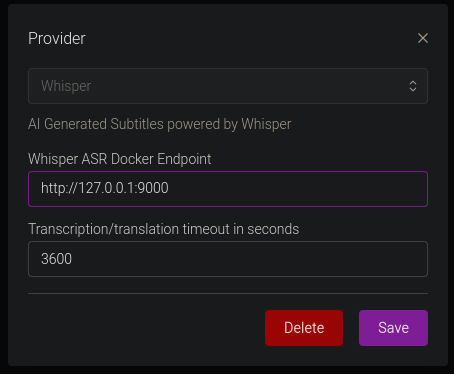

# Whisper Provider Setup

Whisper (based on [OpenAI Whisper](https://github.com/openai/whisper)) uses a neural network powered by your CPU or NVIDIA graphics card to generate subtitles for your media.

Whisper supports transcribing in many languages as well as translating from a language to English. The provider works best when it knows the audio language ahead of time. Make sure the 'Deep analyze media file to get audio tracks language' option is enabled to ensure the best results.

## Choosing a Model

Larger models are more accurate but take longer. Choose the largest model which you are comfortable with and your CPU/GPU can handle

| Model  | Required VRAM | Relative speed |
|--------|---------------|----------------|
| tiny   | ~1 GB         | ~32x           |
| base   | ~1 GB         | ~16x           |
| small  | ~2 GB         | ~6x            |
| medium | ~5 GB         | ~2x            |
| large  | ~10 GB        | ~1x            |


## Docker Installation

Change ASR_MODEL to use the model you like.

### CPU

#### Docker CLI

```
docker run -d -p 9000:9000 -e ASR_MODEL=base onerahmet/openai-whisper-asr-webservice:latest
```

#### Docker Compose

```
---
version: "2.1"
services:
  whisperasr:
    image: onerahmet/openai-whisper-asr-webservice:latest
    environment:
      - ASR_MODEL=small
    ports:
      - 127.0.0.1:9000:9000
    restart: unless-stopped
```

### GPU

#### Docker CLI

```
docker run -d --gpus all -p 9000:9000 -e ASR_MODEL=base onerahmet/openai-whisper-asr-webservice:latest-gpu
```

#### Docker Compose

```
---
version: "2.1"
services:
  whisperasr:
    image: onerahmet/openai-whisper-asr-webservice:latest-gpu
    environment:
      - ASR_MODEL=small
    ports:
      - 127.0.0.1:9000:9000
    deploy:
      resources:
        reservations:
          devices:
            - driver: nvidia
              count: 1
              capabilities: [gpu]
    restart: unless-stopped
```


## Bazarr Configuration

Change the endpoint to the server you are hosting the Whisper container on (127.0.0.1 if on the same machine), and adjust the timeout if you find it keeps timing out on long movies or TV shows.



## Troubleshooting

## Language detection

When Bazarr doesn't know the language of the media you're trying to get subtitles for, Whisper must guess. It only uses the first 30 seconds of audio in order to detect the language. To ensure best results, use media which has the audio language specified in the file, and make sure the deep analyze option is turned on.

Bazarr's implementation of Whisper is still in early stages. If you have any issues, please enable debug logging and reach out on Discord to share your findings.
