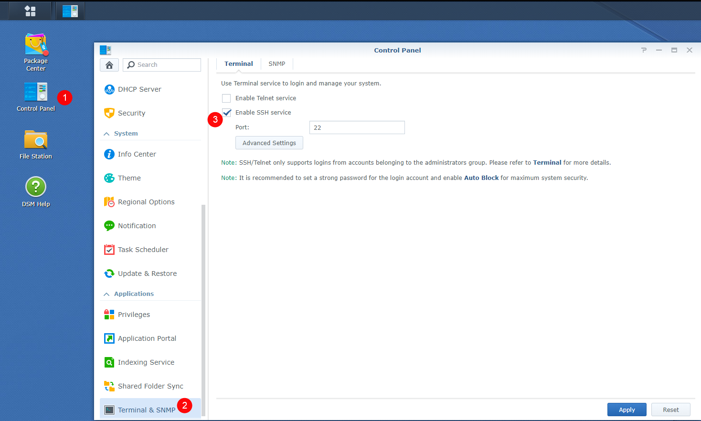
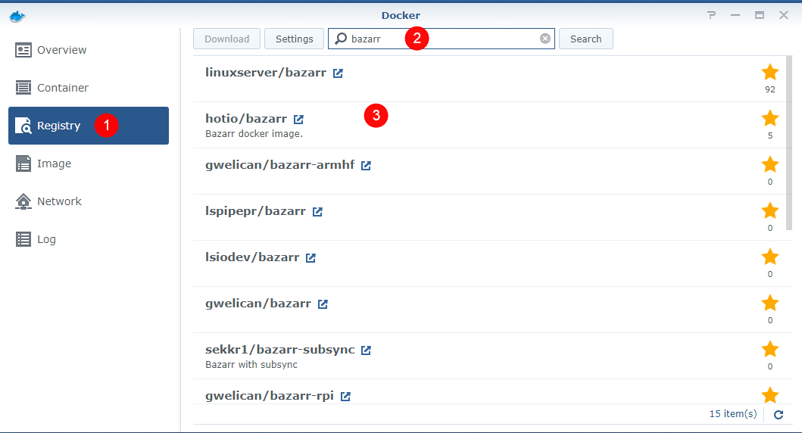
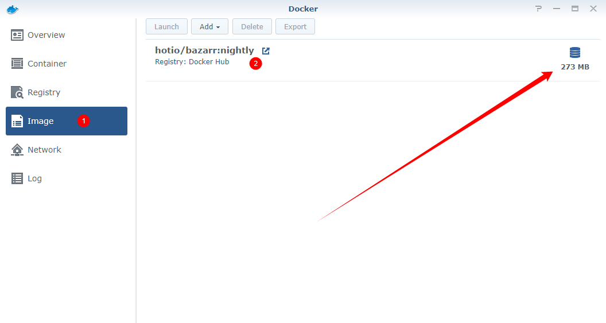
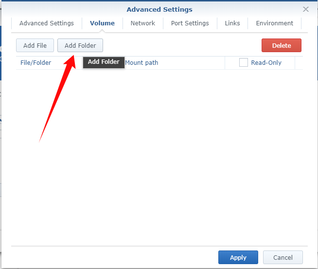
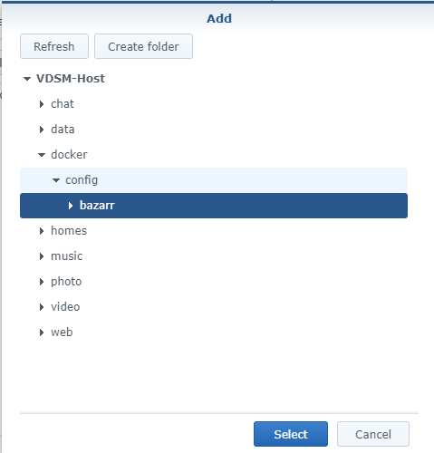
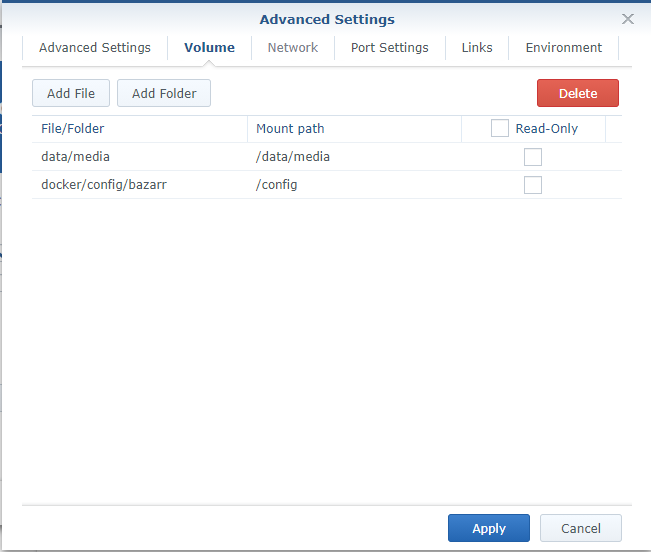
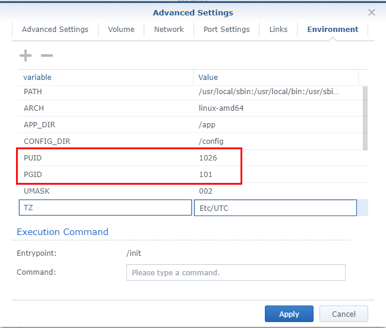
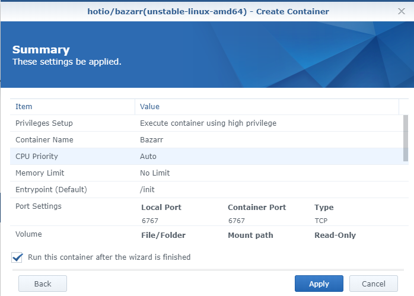

# Synology

It is recommended to run Bazarr with docker when your NAS supports it. A package is also available from SynoCommunity: https://synocommunity.com/package/bazarr. 
We will try to explain the basics how to setup Bazarr on Synology with Docker.

!!! TIP
    Depending if you're smart and decide switch everything to Docker then you're done after this guide.

    If you decide to mix packages with docker you will need to mess with [Path Mappings](/Additional-Configuration/Settings/#path-mappings).

## PUID and PGID

In order for the Docker container to access the shares on the Synology,
we need to give it the same permissions as your main user who has access to those shares.
For this we need to figure out the PUID and the PGID of the user having access to your shares.

You will need to SSH into your Synology.
If you didn't already enable it you need to do that first


Then use a program like Putty and SSH to your Synology.

Login if you get a popup asking if you want to trust the key,
Just press `OK` or `ACCEPT`

Enter the login information of your main Synology user account.


Once logged in type:

```bash
id
```

This will show your UID (aka PUID).

Which in this screenshot is `1026`

and the GID (aka PGID) which is `101` for the administrator.

Remember these values for later use.

!!! Info
    *yes we know it's not recommended to use the admin account but if you already know this then you wouldn't need to read this* ;)

### Now you got 3 options to install Bazarr

1. [Install Bazarr with the GUI in the Synology interface (Takes longer)](#install-bazarr-with-the-gui-in-the-synology-interface-takes-longer)
1. [Install Bazarr using SSH](#install-bazarr-using-ssh)
1. [Install Bazarr and the rest with docker compose](https://trash-guides.info/Misc/how-to-set-up-hardlinks-and-atomic-moves/)

------

#### Install Bazarr with the GUI in the Synology interface (Takes longer)

Install(if you didn't do that already) and open docker.



Select `Registry` and type `bazarr` in the search bar.
We recommend to use one of the following 2 images.
`linuxserver/bazarr` or `hotio/bazarr`.
For this example I will use the `hotio/bazarr`.
Then you will get a popup asking which Tag you want to use.
select `latest` for the stable build.


or select `nightly` if you want to use the dev version.
 

In this example I will use the dev build.

Then on the left select `Image` and wait till it's loaded you can see when it's done where the arrow is pointed and it stops building.
 

Then double click on the created image.

#### General Settings


1. Give the  container a friendly name (e.g. `bazarr`).
1. Enable this (not sure if it's needed but you can test that later yourself)
1. Then select `Advanced Setttings`

##### Advanced Settings


Select `Enable auto-restart` if you want Bazarr to autostarts.

##### Advanced Settings - Volume



Click on `Add Folder`



Create a folder named `config` and create in that folder a folder called `bazarr`.
This will be used for the database, config and log files.



Also add your `tv` and your `movies` folder locations,
In this Guide we used the preferred path setup that's why we used `/data/media`.

##### Advanced Settings - Port Settings


Change the `local port` from `automatic` to the official port `6767`.

##### Advanced Settings - Environment



Now we need to add the `PUID` and `PGID` that we wrote down earlier.
If you don't have the `PUID` and `PGID` option as variable then add it yourself.

Then click `Apply` and `Next`.



Recheck your setting and click on `Apply`.


Select on the left `Container` and you can see if it's running.

Now you can access the Bazarr docker container by typing in your browser
<http://your_synology_ip_or_your_synology_hostname:6767>
and then follow the [Setup-Guide](/Getting-Started/First-time-installation-configuration/).

------

#### Install Bazarr using SSH

First create a `config` folder in your `docker`  folder and create a `bazarr` folder in it.
Then you ssh into your Synology and you type one of the the following depending which image you want to use.

##### Stable build

hotio/bazarr

```bash
sudo docker run -d --name bazarr -v /volume1/docker/config/bazarr:/config -v /volume1/data/media:/data/media -e PUID=1026 -e PGID=101 -p 6767:6767 hotio/bazarr:latest
```

linuxserver/bazarr

```bash
sudo docker run -d --name bazarr -v /volume1/docker/config/bazarr:/config -v /volume1/data/media:/data/media -e PUID=1026 -e PGID=101 -p 6767:6767 linuxserver/bazarr:latest
```

##### Development build

hotio/bazarr

```bash
sudo docker run -d --name bazarr -v /volume1/docker/config/bazarr:/config -v /volume1/data/media:/data/media -e PUID=1026 -e PGID=101 -p 6767:6767 hotio/bazarr:nightly
```

linuxserver/bazarr

```bash
sudo docker run -d --name bazarr -v /volume1/docker/config/bazarr:/config -v /volume1/data/media:/data/media -e PUID=1026 -e PGID=101 -p 6767:6767 linuxserver/bazarr:nightly
```

**Extra info:**

- `--name bazarr` = Container name.
- `-v /volume1/docker/config/bazarr:/config` = Your path to your config location.
- `-v /volume1/data/media:/data/media` = Your path to your tv shows/series and movies.
- `-e PUID=1026` = Your PUID (*that we found earlier*).
- `-e PGID=101` = Your PGID (*that we found earlier*).
- `-p 6767:6767` = The ports Bazarr is going to use.
- `hotio/bazarr:xxx` = Which image and build is going to be used.

------

For his Wiki/Guide I used the following sources being that I don't have a Synology myself.

[Dr_Frankenstein's Tech Stuff](https://drfrankenstein.co.uk/2017/03/28/setting-up-radarr-in-docker-on-a-synology-nas/)

[NAS Guides](https://nasguides.wordpress.com/)

[DSM 6.2 Online Demo](https://demo.synology.com/en-global/dsm)

[Docker Guide](https://wiki.servarr.com/Docker_Guide) (thnx to @fryfrog)

Help from some Synology users on the [Discord Server](https://discord.gg/MH2e2eb).
